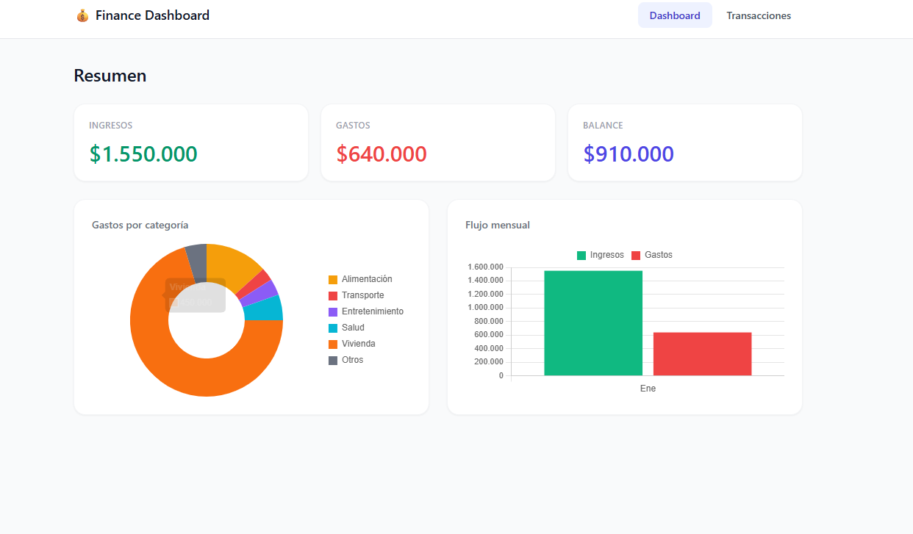

# 💰 Finance Dashboard

🔗 **[Ver demo en vivo](https://finance-dashboard-phi-hazel.vercel.app/)**

A personal finance tracker built with **Angular 21**, **Signals**, and **Tailwind CSS**. Track your income and expenses, visualize spending by category, and monitor your monthly balance — all stored locally in your browser.


---

## ✨ Features

- 📊 Monthly summary — total income, expenses, and balance
- 🍩 Spending breakdown by category (donut chart)
- 📈 Monthly cash flow chart (bar chart)
- 📋 Transaction list with filters
- ➕ Add, edit, and delete transactions
- 🌙 Dark mode support
- 💾 Data persisted in localStorage — no backend required

---

## 🛠️ Tech Stack

| Technology | Purpose |
|---|---|
| Angular 21 | Framework — standalone components, new control flow |
| Angular Signals | Reactive state management |
| Tailwind CSS v3 | Utility-first styling |
| Chart.js | Data visualization |
| localStorage | Client-side data persistence |
| TypeScript 5 | Strict typing throughout |

---

## 🚀 Getting Started

### Prerequisites

- Node.js 18+
- Angular CLI 21+

```bash
pnpm install -g @angular/cli
```

### Installation

```bash
# Clone the repository
git clone https://github.com/Alx93Dev/finance-dashboard.git

# Navigate to the project
cd finance-dashboard

# Install dependencies
pnpm install

# Start the development server
pnpm start
```

Open your browser at `http://localhost:4200`

---

## 📁 Project Structure

```
src/
└── app/
    ├── core/
    │   ├── models/
    │   │   ├── transaction.model.ts
    │   │   └── category.model.ts
    │   └── services/
    │       ├── transaction.service.ts   ← signals-based state
    │       └── storage.service.ts
    ├── features/
    │   ├── dashboard/
    │   └── transactions/
    │       └── transaction-form/
    └── shared/
        └── components/
            ├── summary-card/
            └── nav/
```

---

## 🧠 Key Angular Concepts Used

- **Signals & computed()** — reactive state without RxJS overhead
- **Standalone components** — no NgModules
- **input()** — new signal-based input API
- **inject()** — functional dependency injection
- **@if / @for** — new Angular 17+ control flow syntax
- **Reactive Forms** — for transaction creation and editing

---

## 📸 Screenshot



---

## 📄 License

MIT
